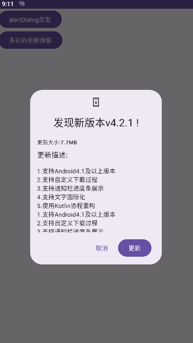
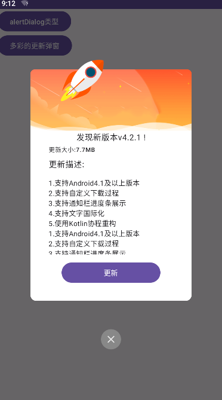

<p align="center">
  
  
</p>

# compose版本效果图



# 效果图


# demo中的自定义下载弹窗示例


# 功能介绍

* [x] 支持Kotlin
* [x] 支持compose
* [x] 界面定制变得极为简单
* [x] 支持后台下载
* [x] 支持强制更新
* [x] 支持自定义下载过程
* [x] 支持Android4.1及以上版本
* [x] 支持通知栏进度条展示(或者自定义显示进度)
* [x] 支持中文/繁体/英文语言（国际化）
* [x] 支持取消下载(如果发送了通知栏消息，则会移除)
* [x] 支持下载完成 打开新版本后删除旧安装包文件
* [x] 不需要申请存储权限
* [x] 使用HttpURLConnection下载，未集成其他第三方框架

# 使用步骤

## 1.添加依赖

### 最新版本： [](https://jitpack.io/#Knightwood/AppUpdateChecker)

```kotlin
1.2.0
implementation("com.github.knightwood:AppUpdateChecker:1.2.0")

1.2.0 之后版本开始 ：
implementation("com.github.Knightwood.AppUpdateChecker:appupdatechecker-core:last_version") //必选，当然，你也可以抛开下面的界面实现，完全自己实现界面。没有界面亦一样使用
implementation("com.github.Knightwood.AppUpdateChecker:appupdatechecker-compose-ui:last_version") //compose版本的下载界面，可选
implementation("com.github.Knightwood.AppUpdateChecker:appupdatechecker-view-ui:last_version") //view体系下的下载界面，可选
```

settings.gradle可能需要添加:

```kotlin

dependencyResolutionManagement {
    repositoriesMode.set(RepositoriesMode.FAIL_ON_PROJECT_REPOS)
    repositories {
        maven("https://www.jitpack.io")
    }
}
```

## 2.创建`DownloadManager`。

更多用法请查看[这里示例代码](https://github.com/Knightwood/AppUpdateChecker/blob/main/app/src/main/java/com/azhon/app/MainActivity.kt)

示例:

```kotlin
//配置一个DownloadManager
val manager = DownloadManager.config(application) {
    apkUrl = url
    apkName = this@MainActivity.apkName
    apkVersionCode = 2
    apkVersionName = "v4.2.1"
    apkSize = "7.7MB"
    apkDescription = getString(R.string.dialog_msg)
    forcedUpgrade = false
}

```

`DownloadManager`是个单例，每次使用`DownloadManager.DownloadConfig`配置`DownloadManager`
时，都会取消上一个下载任务。

如果要判断当前没有没下载，可以调用如下方法进行判断

```kotlin
    DownloadManager.isDownloading()
```

## 3.显示更新弹窗

### view版本

* 内置界面

```kotlin
class UpdateDialogType {
    companion object {
        const val None = 0 //不使用界面
        const val Colorful = 1 //默认更新界面，由DialogFragment实现
        const val SimpleDialog = 2 //MaterialAlertDialog实现的更新界面
    }
}

```

```kotlin

//显示更新弹窗界面
showDownloadDialog(manager, updateDialogType = viewStyle)

```

### compose版本

compose版本与view版本一样具有两个内置弹窗

* SimpleDialog类型

```kotlin

var openDialog by remember { mutableStateOf(false) }

if (openDialog) {
    AlertUpdateDialog(
        context = this,
        downloadManager = manager
    ) {
        openDialog = false
    }
}

Button(onClick = {
    openDialog = true
}) {
    Text(text = "alertDialog类型")
}
```

* Colorful类型

```kotlin

var openDialog2 by remember { mutableStateOf(false) }

if (openDialog2) {
    ColorfulUpdateDialog(
        context = this,
        downloadManager = manager,
        confirmButton = { modifier, text, enabled, onClick ->
            ConfirmButton(modifier, text, enabled, onClick)
        }
    ) {
        openDialog2 = false
    }
}

Button(onClick = {
    openDialog2 = true
}) {
    Text(text = "多彩的更新弹窗")
}
```

## 配置下载信息得到DownloadManager详细用法

### 使用DownloadManager.DownloadConfig配置DownloadManager

配置项中，必需的参数有`apkUrl`、`apkName`、`apkDescription`

- DownloadManager

| 函数和变量             | 描述       |
|-------------------|----------|
| canDownload       | 是否可以下载   |
| checkThenDownload | 检查并下载    |
| directDownload    | 直接下载     |
| downloadStateFlow | 下载任务的状态流 |
| downloadState     | 是否正在下载   |
| config            | 配置项      |

- AppUpgradeHolder
  用于根据manager显示更新界面，一些快捷方法，如果你自定义界面，就用不到他

| 函数                                                                                                                       | 描述                   |
|--------------------------------------------------------------------------------------------------------------------------|----------------------|
| FragmentActivity.showDownloadDialog( downloadManager: DownloadManager,updateDialogType: Int = UpdateDialogType.Colorful) | 配置并显示内置下载界面          |
| FragmentActivity.showDownloadDialog(updateDialogType: Int,block: DownloadManager.DownloadConfig.() -> Unit)              | 配置并显示内置下载界面          |
| DownloadManager.showDownloadDialog(updateDialogType: Int,activity: FragmentActivity)                                     | 使用Builder配置并显示内置下载界面 |
| DownloadManager.showDownloadDialog()                                                                                     | 使用Builder配置并显示内置下载界面 |
| showUi(downloadManager: DownloadManager,updateDialogType: Int, activity: FragmentActivity)                               | 仅显示内置下载界面            |

对于`showUi`方法：在使用内置界面时，你开始下载应用，并关闭了下载弹窗。
当你调用showUi时，弹窗会继续显示下载进度，而不会重新开始下载。

#### 使用Builder配置DownloadManager

```kotlin
val downloadManager = DownloadManager.Builder(this).run {
    apkUrl(url)
    apkVersionCode(2)
    apkVersionName("v4.2.1")
    apkSize("7.7MB")
    apkName(this@MainActivity.apkName)
    apkDescription(getString(R.string.dialog_msg))
    updateDialogType(UpdateDialogType.SimpleDialog)//修改样式
    build()
}
downloadManager.showDownloadDialog(activity)//如果不传activity参数，updateDialogType则不起作用

```

DownloadManager的一些其他配置项

```kotlin
 val manager = DownloadManager.config(application) {
    httpManager = myHttpManager //替换默认下载功能
    notificationChannel = ... //修改通知渠道
    onButtonClickListener = {} //监听界面的按钮事件（BaseUpdateDialogFragment）
}
manager.registerDownloadListener(listenerAdapter)//自行监听下载进度
manager.clearListener()//清除下载监听
manager.checkThenDownload()//立即开始下载


```

下载监听除了可以使用`registerDownloadListener`，还可以监听downloadManager中的状态流,
下面是DownloadManager中的状态变量

```kotlin
  /**
 * 是否正在下载
 */
var downloading: Boolean = false

/**
 * 下载事件状态流
 */
var downloadStateFlow: MutableStateFlow<DownloadStatus> = MutableStateFlow(DownloadStatus.IDLE)

/**
 * 百分比进度
 */
val progressFlow: MutableStateFlow<Float> = MutableStateFlow(0f)

```

## 自定义界面

### view 自定义界面示例：

- 需要做的事情极其简单，你不需要关注下载的流程，监听之类的，只需要继承并重写布局，然后显示这个自定义的DialogFragment

* 步骤：

1. 写一个类继承`BaseUpdateDialogFragment`，重写布局
2. 跟往常一样通过`DownloadManager.config(application)`生成一个[DownloadManager]
3. 显示你的自定义的DialogFragment

注意，在BaseUpdateDialogFragment中，进度条可以是任意视图，如果你的进度条不是`ProgressBar`，那么你需要重写

`initProgressBar`和`setProgress`方法。
比如：

```kotlin
/**
 * 设置进度条进度
 * @param progressValue Int
 */
override fun setProgress(progressValue: Int) {
    (progressBar() as NumberProgressBar).progress = progressValue
}

/**
 * 初始化进度条
 *
 */
override fun initProgressBar() {
    (progressBar() as NumberProgressBar).max = 100
}

```

示例：

1. 继承BaseUpdateDialogFragment
2.

BaseUpdateDialogFragment已经封装了进度监听之类的东西，你只需要自定义界面就行

```kotlin
class Win8UpdateDialogFragment : BaseUpdateDialogFragment() {

    override fun onCreateView(
        inflater: LayoutInflater,
        container: ViewGroup?,
        savedInstanceState: Bundle?
    ): View {
        setStyle(STYLE_NORMAL, R1.style.M3AppTheme)
        mView = inflater.inflate(R.layout.app_update_dialog_win8, container, false)
        //全屏
        dialog?.window?.let { window ->
            //这步是必须的
            window.setBackgroundDrawableResource(R1.color.transparent)
            //必要，设置 padding，这一步也是必须的，内容不能填充全部宽度和高度
            window.decorView.setPadding(0, 0, 0, 0)
            // 关键是这句，其实跟xml里的配置长得几乎一样
            val wlp: WindowManager.LayoutParams = window.attributes
            if (Build.VERSION.SDK_INT >= Build.VERSION_CODES.P) {
                wlp.layoutInDisplayCutoutMode =
                    WindowManager.LayoutParams.LAYOUT_IN_DISPLAY_CUTOUT_MODE_SHORT_EDGES
            }
            wlp.gravity = Gravity.CENTER
            wlp.width = WindowManager.LayoutParams.MATCH_PARENT
            wlp.height = WindowManager.LayoutParams.WRAP_CONTENT
            window.attributes = wlp
        }
        return mView
    }


    companion object {
        const val TAG = "Win8UpdateDialogFragment"

        fun open(host: FragmentActivity) {
            host.run {
                val dialog = Win8UpdateDialogFragment()
                val ft = supportFragmentManager.beginTransaction()
                ft.setTransition(FragmentTransaction.TRANSIT_FRAGMENT_FADE)
                dialog.show(ft, TAG)
            }
        }
    }

}
```

2. 展示界面
   直接配置到manager，然后显示你的界面即可，BaseUpdateDialogFragment基类会自动监听下载状态

```kotlin
//跟往常一样构造DownloadManager
manager = DownloadManager.config(application) {
    //...一些配置项
}

//直接显示界面即可，不需要关注除了界面之外的任何内容
Win8UpdateDialogFragment.open(this)
```

详情查看app中的`PixelUpdateDialogFragment`和`Win8UpdateDialogFragment`

### compose 自定义

使用封装好的compose函数 `BasicUpdateDialog`

```kotlin
    BasicUpdateDialog(
    modifier = modifier,
    context = context,
    downloadManager = downloadManager,
    dismiss = dismiss,
    content = {
            config: DownloadManager.DownloadConfig,
            downloadState: State<DownloadStatus>,
            downloading: () -> Boolean,
            startDownload: () -> Unit,
            cancelDownload: () -> Unit,
            progressValue: Float,
            buttonState: ButtonState,
        ->
        SampleUpdateDialog(
            modifier = modifier,
            config = config,
            dismiss = dismiss,
            downloadState = downloadState,
            downloading = downloading,
            startDownload = startDownload,
            cancelDownload = cancelDownload,
            progressValue = progressValue,
            buttonState = buttonState,
            context = context,
        )

    }
)

//实际显示内容
@Composable
private fun SampleUpdateDialog(
    modifier: Modifier,
    config: DownloadManager.DownloadConfig,
    dismiss: () -> Unit,//关闭界面
    downloadState: State<DownloadStatus>,//下载状态
    downloading: () -> Boolean,//是否正在下载
    startDownload: () -> Unit,//调用函数开始下载
    cancelDownload: () -> Unit,//调用函数取消下载
    progressValue: Float,//进度，文件的大小
    buttonState: ButtonState,//更新按钮状态，封装了文本显示和按钮enabled状态
    context: Context,
) {

}

```

* 自定义下载时，需继承`BaseHttpDownloadManager`

## 混淆打包，只需保持`Activity`、`Service`不混淆

```groovy
-keep public class * extends android.app.Activity
- keep public class * extends android.app.Service
```

### 使用技巧

* 框架内部支持国际化（其他语言只需要在对应的`string.xml`中取相同的名字即可）
* 如果你需要修改框架内部的一些文字，你只需要在`string.xml`中取相同的名字即可以覆盖框架内设定的
* 查看版本库中的Log只需要过滤`AppUpdate`开头的Tag
* 支持校验安装包的MD5避免重复下载，只需要`Builder`设置安装包的MD5即可
* 下载完成 打开新版本后删除旧安装包文件
* 当设置apkVersionCode为MAX_VALUE时，将不校验版本号

- 适配Android 13通知运行权限，且当设置`showNotification(true)`时，点击对话框的升级按钮会申请通知栏权限，无论是否同意都将会继续下载
- 当设置强制更新`forcedUpgrade(true)`时，显示的对话框会显示下载进度条
- 由于Android 10限制后台应用启动Activity，所以下载完成会发送一个通知至通知栏（忽略showNotification的值，需要允许发送通知）

### 相关文档链接

- [限制后台启动Activity](https://developer.android.google.cn/guide/components/activities/background-starts)
- [通知栏适配](https://developer.android.google.cn/guide/topics/ui/notifiers/notifications?hl=zh-cn)

### 删除旧安装包

现在，下载的安装包会放入 /sdcard/Android/data/包名/cache/AppUpdateCache 下
而不会放在/sdcard/Android/data/包名/cache 下

```kotlin
//删除某一个文件
val result =
    ApkUtil.deleteOldApk(this, "${externalCacheDir?.path}/${Constant.cacheDirName}/$apkName")

//删除所有下载的文件
ApkUtil.deleteDefaultCacheDir(application)
```

### 静默下载

调用`manager.directDownload(true)`即可开始静默下载。静默下载不会有通知栏消息，不会自动跳转安装，但是是有进度通知的，方便做一些监听处理。

对于静默下载，需要设置`apkMD5`
，文件在下载之后，会保存在`/sdcard/Android/data/包名/cache/AppUpdateBackCache`下，并计算出下载文件的md5值进行重命名。

你可以使用`deleteBackDownloadCacheDir`方法删除下载的缓存文件。
你可以通过`DownloadManager.isBackDownload`判断是否当前处于静默下载。
同时，`DownloadManager.downloadStateFlow`之类的状态也都是正常可用的。

静默下载之后，内置ui界面会自动判断，是否存在匹配的md5的安装包，如果存在，则可以直接点击安装。

下载服务也会自动判断是否存在匹配的md5的安装包，如果存在，则直接视为下载完成。

#### 使用示例：

##### view版本

```kotlin
   manager = DownloadManager.config(application) {
    //这里忽略了其它参数的设置，静默下载必须设置md5值
    apkMD5 = "3e4ed027f0b9dd68c335b5338e6a1b1f"
}
//注册按钮监听
manager.registerButtonListener(object : OnButtonClickListener {
    override fun onButtonClick(action: Int) {
        Log.d(TAG, "onButtonClick: $action")
        //如果点击了取消，并且不处于下载状态，则可以静默下载
        if (action == OnButtonClickListener.CANCEL && !manager.downloading) {
            manager.directDownload(true)//静默下载
        }
    }
})
showDownloadDialog(manager, updateDialogType = viewStyle)
```

##### compose版本

```kotlin
manager = DownloadManager.config(application) {
    //这里忽略了其它参数的设置，静默下载必须设置md5值
    apkMD5 = "3e4ed027f0b9dd68c335b5338e6a1b1f"
}
manager.registerButtonListener(object : OnButtonClickListener {
    override fun onButtonClick(action: Int) {
        Log.d(TAG, "onButtonClick: $action")
        if (action == OnButtonClickListener.CANCEL && !manager.downloading) {
            manager.directDownload(true)//client download
        }
    }
})

//ui界面
var openDialog by remember { mutableStateOf(false) }

if (openDialog) {
    AlertUpdateDialog(
        context = this,
        downloadManager = manager
    ) {
        openDialog = false
    }
}
```

#### 只显示界面，安装特定路径下的安装包

这个功能是在某些场景下，安装特定路径下的安装包，而不是使用默认的静默下载路径下的安装包。

* view版本

```kotlin
DefaultUpdateDialogFragment.open(activity, cacheApkFilePath)

SimpleUpdateDialog.openAlertDialog(activity, downloadManager, cacheApkFilePath)
```

* compose版本

```kotlin
AlertUpdateDialog(
    context = this,
    downloadManager = manager,
    cacheFile = File(path),
)

ColorfulUpdateDialog(
    context = this,
    downloadManager = manager,
    cacheFile = File(path),
    confirmButton = { modifier, text, enabled, onClick ->
        ConfirmButton(modifier, text, enabled, onClick)
    }
)
```